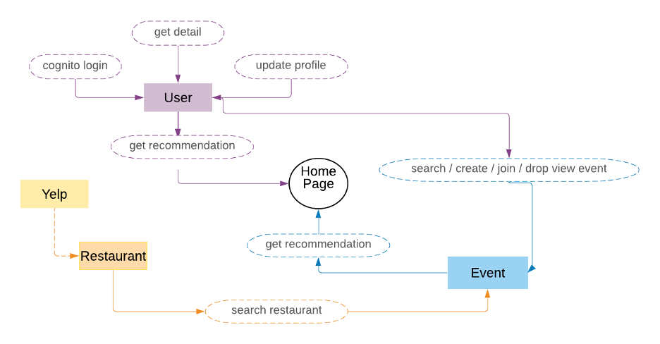
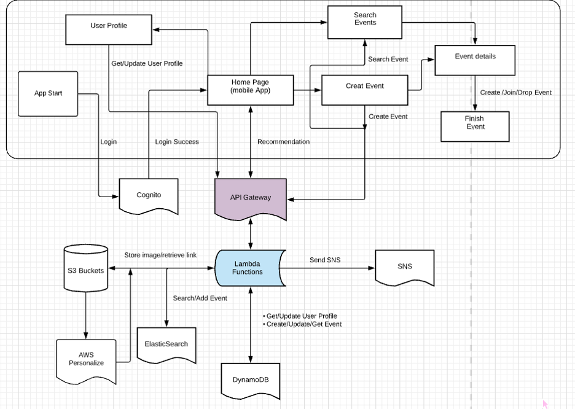

WeFoodies Final Report

Group members: yf2549, yc3936, jj3132, xl2869

# 1. Project proposal

**WeFoodies!** -- **An online dining arranging and social web application**  

For the people who want to dine out but don’t want to eat alone 
## Introduction
In this app, you can get recommendations for restaurants according to your needs and dine out with people who share the same tastes for food! (one-stop app including restaurant recommendations and people-matching)

**Features**

**User types : Foodie(the customers dining in) / Restaurants**

- Meet up with friends and strangers alike (other users)
  - Reduce spending by sharing the bill.
  - Meet interesting people who share the same tastes for food.
- Automatic recommending System:  Automatically recommend nearby dining events for users to join. 
  - As the data generated from the system grows**,**  we can use it to improve the recommending system to increase the match rate
  - Let restaurants initiate themed events and broadcast it to nearby users
- Multi-user social interactions: posting food photos, adding comments for restaurants and foods
- Random match-up beacon: set up Together! Beacon near restaurant areas and allow app users to gather before selecting a restaurant (mingle their restaurant knowledge!)

**Existing similar work**

- Eattogether: Only for posting food, unable to dine out together
- Tine: Only for creating a gathering event, not specializing for dining out.

**Innovation / why interesting**

1. Meet up with strangers(other users) to eat together
1. When there is an enough amount of users data,  we can gradually make a recommendation of dating and restaurants based on some of the users data.
1. Random match-up beacon: allow nearby app users to gather before selecting a restaurant

**Data sources:**

Yelp, Google review, Open Table

\2. Clickable Prototype
[**https://invis.io/KM109W5YPC9R**](https://invis.io/KM109W5YPC9R)
==================================================================

# 3. Architecture and APIs

 

## API List:
- Login
  - Cognito API
- User: 
  - GET user/getprofile
    - Parameters:
      - UserID
      - UserToken
    - ResponseMessage
      - User

- POST user/setprofile
  - Parameters
    - UserProfile 
      - Name
      - Email
      - Gender
      - ImgURL
      - IsMerchant
  - ResponseMessage
    - StatusCode
- GET user/recommendation
  - Parameter
    - UserID
  - ResponseMessage (list)
    - [UserID]
- POST user/follow
  - Parameter
    - userID

- Event
  - GET event/search (q=?)
    - Parameters
      - UserToken
      - KeyWord
    - ResponseMessage
      - SearchResult (list)
        - [EventID]
  - GET event/searchbyrid (q=?)
    - Parameters
      - Restaurant id
  - GET event/searchbyuid (q=?)
    - Parameters
      - User id
  - GET event/detail (header={evenids}
    - Parameters
      - EventID
    - ResponseMessage
      - EventDetail
  - POST event/create
    - Parameters
      - EventDetail
    - ResponseMessage
      - StatusCode
  - POST event/join
    - Parameters
      - EventID
    - ResponseMessage
      - StatusCode
  - POST event/drop
    - Parameters
      - EventID
      - UserID
      - Token
    - ResponseMessage
      - StatusCode
  - GET event/recommendation
    - Parameters
      - UserID
    - ResponseMessage
      - Result(list)
        - [EventID]

